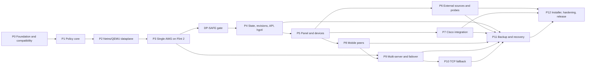

# Home Gateway Development Master Plan

> **For agentic workers:** REQUIRED SUB-SKILL: use `superpowers:writing-plans` to create a phase-specific plan, then `superpowers:subagent-driven-development` (recommended) or `superpowers:executing-plans` to implement it task by task. This master plan does not authorize implementation without the phase approval gate.

**Goal:** реализовать воспроизводимый и безопасно обновляемый домашний шлюз для GL.iNet Flint 2 / GL-MT6000, который оставляет WAN маршрутом по умолчанию, выборочно направляет VPN-класс через личный VPS, не вмешивается в политики Cisco Secure Client и выдаёт мобильные AmneziaWG-профили.

**Architecture:** risk-first modular monolith на Go. Сначала формализуется policy model и доказывается dataplane safety в Linux network namespaces/OpenWrt QEMU, затем тот же production backend проверяется на GL-MT6000 и реальном VPS. Web/API, внешние списки, Cisco, mobile peers, backup и failover добавляются отдельными vertical slices поверх неизменяемого safety regression gate.

**Tech Stack:** Go; OpenWrt 25.12.5, target `mediatek/filogic`, package architecture `aarch64_cortex-a53`; `netifd`; `firewall4`; `nftables`; `ip rule`; `dnsmasq-full`; портированные из официальных upstream AmneziaWG module/tools; SQLite-compatible embedded store; Go `html/template` + HTMX или эквивалентный малый vendored JS; PowerShell; Pester; Playwright; Linux network namespaces; OpenWrt QEMU/SDK; GitHub Actions или эквивалентный CI.

## Global Constraints

- Маршрут OpenWrt по умолчанию всегда WAN; VPN не устанавливает default route в `main`.
- Только `routerd` владеет policy-routing marks, chains, sets и routing tables.
- VPN-класс при недоступном VPN завершается `blackhole`/`unreachable` и не проваливается в WAN.
- `direct`, `system-direct` и разрешённый Cisco traffic продолжают работать при падении VPN.
- IPv4 и IPv6 реализуются и тестируются вместе; режим IPv6 для VPN-класса — route или explicit block без утечки.
- Control plane не реализует криптографию и не проксирует пользовательский traffic.
- Любое изменение проходит plan, validation, snapshot, apply, post-check и commit/rollback.
- External content является data; remote shell scripts не исполняются.
- Все production versions, artifacts, image digests и SHA-256 фиксируются в manifest; `latest` запрещён.
- Secrets, private keys, mobile profiles и full backups не попадают в Git, logs, process arguments или support bundles.
- Cisco profile/policy, certificates и TLS traffic не изменяются и не инспектируются.
- Русский — основной язык UI/docs; identifiers, API и code — English.
- Все install/update operations идемпотентны, поддерживают dry-run и безопасное повторное выполнение.
- Первый production release включает panel, sources, Cisco integration, mobile peers, backup, multi-server model и рабочий TCP fallback.
- Наличие готового official AWG2 package для OpenWrt не предполагается: compatibility gate должен собрать и проверить exact module/tools/netifd tuple.

---

## 1. Статус входных данных

- Канонический input: `HOME_GATEWAY_CODEX_SPEC.md`, версия 1.0 от 2026-07-11.
- Репозиторий пока содержит только спецификацию; Git не инициализирован.
- На текущей Windows-машине есть Git 2.52.0, Docker client 29.2.0 и WSL2; Docker daemon остановлен, отдельный Linux lab не подтверждён.
- Локально не обнаружены Go, PowerShell 7 и GNU Make. Windows PowerShell 5.1 остаётся доступным runtime для совместимого bootstrap path.
- Поэтому Phase 0 включает воспроизводимый developer toolchain и Linux lab; installation инструментов не выполняется в рамках планирования.

### 1.1. Проверенный upstream baseline на 2026-07-12

| Area | Подтверждённый факт | Следствие для разработки |
|---|---|---|
| OpenWrt | 25.12.5 — stable; GL-MT6000 находится в `mediatek/filogic`, package arch `aarch64_cortex-a53`, kernel baseline `6.12.94` | Lock exact image/SDK SHA, kernel ABI/vermagic и profile metadata; binary внутри APK собирается как `GOOS=linux GOARCH=arm64` |
| OpenWrt packages | 25.12 использует APK v3; canonical package metadata должна указывать `aarch64_cortex-a53` | Release artifact называется `routerd_<version>_aarch64_cortex-a53.apk`, а не неоднозначное `aarch64.apk` |
| AmneziaWG OpenWrt | Официальный `amneziawg-openwrt` не публикует готовые 25.12/AWG2 releases; старый helper не знает AWG2 fields `S3`, `S4`, `I1..I5` | P0 обязан портировать свежие official kernel/tools в OpenWrt package feed и обновить `netifd` proto/UCI schema |
| AmneziaWG current pair | Official kernel tag `v1.0.20260611` и tools release `v1.0.20260618-2` содержат AWG2 UAPI/`syncconf`, но не OpenWrt assets | Эти версии — starting candidate, не accepted dependency, пока APK/module load/handshake/reboot/performance не пройдут на exact kernel |
| AWG userspace contingency | Official `amneziawg-go` tag `v0.2.19` поддерживает AWG2, но не публикует готовые binaries | Contingency требует arm64 cross-build, `netifd`/`procd` integration и benchmark; 300 Mbps заранее не обещается |
| DNS/firewall | OpenWrt `dnsmasq-full` поддерживает nftset; default image содержит обычный `dnsmasq`; `firewall4` читает `ruleset-post/*.nft` | Installer транзакционно заменяет package с сохранением UCI; заранее создаются отдельные IPv4/IPv6 sets |
| Staging | `fw4 print` рендерит active auto-includes и не принимает отдельный staging include path | Validator формирует отдельный complete candidate ruleset из `fw4 print` + staged fragment и запускает `nft -c -f` до замены active include |
| TCP fallback | Xray VLESS Reality/TUN и sing-box TUN/Reality доступны; sing-box `auto_route`/`auto_redirect` сами меняют routing/firewall | Выбранный core запускается с auto-routing выключенным; все marks/routes остаются собственностью `routerd` |
| Runet Freedom | Категории `ru-blocked`/`ru-available-only-inside` не являются asset names большого release | Descriptor задаёт immutable asset, checksum и converter/category; предпочтительны отдельные `ru-blocked.txt`/`geosite-ru-only.dat`, где доступны |
| Re:filter | `community.lst` сейчас не является release asset и существует как mutable branch file | Использовать commit-pinned blob/content SHA либо собственный immutable mirror; не подменять семантически другим asset |

Primary evidence фиксируется в `docs/COMPATIBILITY.md`: [OpenWrt 25.12](https://openwrt.org/releases/25.12/start), [25.12.5 filogic profiles](https://downloads.openwrt.org/releases/25.12.5/targets/mediatek/filogic/profiles.json), [AmneziaWG kernel v1.0.20260611](https://github.com/amnezia-vpn/amneziawg-linux-kernel-module/tree/v1.0.20260611), [AmneziaWG tools v1.0.20260618-2](https://github.com/amnezia-vpn/amneziawg-tools/releases/tag/v1.0.20260618-2), [OpenWrt AmneziaWG helper](https://github.com/amnezia-vpn/amneziawg-openwrt/blob/master/amneziawg-tools/files/amneziawg.sh), [firewall4 include contract](https://github.com/openwrt/firewall4/blob/b6e5157527d361f99ad52eaa6da273cb0f2dfd59/root/usr/share/nftables.d/README), [OpenWrt sing-box package](https://github.com/openwrt/packages/blob/openwrt-25.12/net/sing-box/Makefile).

## 2. Подтверждённые пользовательские решения

1. Work PC с Cisco подключается непосредственно к Flint 2.
2. Ethernet — основной вариант; Wi-Fi Flint 2 допустим как резервный.
3. Work PC никогда не подключается через Xiaomi-ретранслятор.
4. Ethernet MAC/client-id и Wi-Fi MAC/client-id представляют одну logical device `work-pc` с несколькими разрешёнными identities.
5. Windows Random Hardware Address для домашнего SSID должен быть отключён либо явно диагностирован.
6. Если Cisco запрещает local LAN, система не обходит policy: панель открывается с другого разрешённого admin device либо после отключения Cisco.
7. `cisco-discovery` хранит pending snapshot локально и отправляет его после восстановления разрешённой связи с router API.

## 3. Уровни готовности

| Уровень | Значение | Что ещё не разрешено утверждать |
|---|---|---|
| `lab-safe` | Policy model и dataplane safety доказаны в unit/property/netns/QEMU tests | Реальная совместимость Flint 2/AWG и performance |
| `single-site core-ready` | Один Flint 2 + один VPS проходят selective-routing, fail-closed, reboot и recovery smoke | Реальный multi-VPS failover и полный release acceptance |
| `feature-complete` | Все обязательные control-plane slices реализованы и прошли deterministic tests | Field qualification, performance и подписанный release |
| `field-qualified 1.0` | Закрыта вся acceptance matrix на реальном router/VPS/Cisco/mobile стенде | Ничего из обязательного scope |

Один VPS достаточен до `single-site core-ready` и для большей части feature work. Для `field-qualified 1.0` нужен второй VPS у другого provider/ASN: simulated failover не заменяет real acceptance.

## 4. Варианты декомпозиции

### Вариант A — safety spine → feature slices (выбран)

Сначала executable policy model, netns/QEMU и реальный single-AWG dataplane; затем headless control plane и UI; после этого независимые feature slices. Риск утечки и потери управления снимается до появления большого control plane.

### Вариант B — буквально Milestone 0–7 из спецификации

Проще сопоставлять прогресс исходному документу, но исходный Milestone 1 слишком широк, а revisions/rollback появляются только в Milestone 2. Это допускает реальный VPN dataplane до полноценного transaction/LKG механизма.

### Вариант C — component-first parallel

`routerd`, `server-agent`, Windows agent, web и installer развиваются отдельно, затем интегрируются. Подходит большой команде, но создаёт поздний contract drift и оставляет safety emergent property. Для solo/Codex execution не выбран.

## 5. Dependency map



P6, P7 и P8 можно разрабатывать параллельно только после стабильного P5. Merge каждого slice отдельно прогоняет полный `DP-SAFE` regression suite.

## 6. Обязательные architecture decisions до dataplane-кода

Phase 0 создаёт `DECISIONS.md` и следующие ADR. ADR принимается только с testable consequences и rollback/recovery implications.

| ADR | Решение, которое нужно зафиксировать | Рекомендуемая исходная позиция |
|---|---|---|
| ADR-0001 | Supported firmware baseline и recovery path | OpenWrt 25.12.5 `mediatek/filogic` / `aarch64_cortex-a53` — verified target baseline; upstream OpenWrt и stock GL.iNet рассматриваются как разные recovery/compatibility profiles |
| ADR-0002 | AWG primary и TCP fallback | Port official AWG2 kernel/tools + netifd integration first; `amneziawg-go` is measured contingency; independent VLESS Reality TUN adapter is selected by benchmark |
| ADR-0003 | Routing ownership, marks и stickiness | Mask reservation + per-server connection marks/tables; новые connections идут на active server, старые drain на прежнем healthy tunnel |
| ADR-0004 | Formal precedence и DNS no-leak scope | Origin tier выигрывает раньше specificity; specificity применяется внутри tier; shared-IP collision выбирает `direct`; guarantee действует для managed DNS и explicit device policy |
| ADR-0005 | Transaction/rollback model | Local commit-confirm watchdog; DB+nft+dnsmasq/UCI — coordinated local transaction; router↔VPS — idempotent saga с compensation, а не ложная distributed atomicity |
| ADR-0006 | State, secrets и portable backup | Embedded transactional store; secrets отделены; unattended backup использует `age` recipient, device keys wrap-ятся recovery key |
| ADR-0007 | Mobile peer lifecycle | One device/server pair — one keypair; one-time material single-consumption, TTL 10 minutes; DB сохраняет public key и metadata |
| ADR-0008 | Cisco discovery и device identity | Read-only Windows observation; scoped token; offline queue; logical device поддерживает Ethernet/Wi-Fi identities; work PC нельзя перевести в `always-vpn` |
| ADR-0009 | Supply chain и signing | Separate development/release signing; no secret in CI logs; manifest, checksums, signatures, SBOM и provenance обязательны |

Дополнительные решения, входящие в ADR/tests:

- `system-direct` не является произвольно редактируемым списком: writers — inventory, server manager, Cisco endpoint approver, DNS/NTP/recovery manager; каждое изменение audited.
- Cisco split tunnel и full tunnel имеют разные acceptance branches. При full tunnel система только диагностирует и не обещает routing non-work traffic через router VPN.
- Work PC до прохождения Cisco field gate работает в `always-direct` либо в ограниченном `auto` без внешних auto-applied VPN entries.
- Cold boot сначала восстанавливает last-known-good safety rules/sets, затем открывает forwarding; cached client destinations и DoH limitation явно входят в threat/guarantee model.
- Trust modes унифицируются как `manual-approval` и `trusted-auto-apply`; пример `staged-auto` мигрирует в один из этих enum values.
- UI action называется `Работа / прямой WAN`, а не создаёт впечатление, что router умеет направить traffic внутрь Cisco tunnel.

## 7. Dataplane safety gate

До P4 запрещено начинать production API/UI. P1–P3 должны доказать следующие invariants:

| Traffic class | VPN healthy | VPN unavailable | Проверяемый инвариант |
|---|---|---|---|
| default / `direct` | WAN | WAN | `main` default route не изменяется |
| `system-direct` | WAN | WAN | VPN/Cisco/DNS/NTP/recovery endpoints не рекурсируют в VPN |
| `vpn` | selected VPN | terminal block | lookup не проваливается в `main` |
| `always-vpn` | selected VPN, кроме protected exceptions | terminal block, кроме protected exceptions | нет global WAN outage |
| `auto-cisco` fixture | WAN только для `work-pc` identity | WAN только для `work-pc` identity | другие devices не получают исключение |
| IPv6 VPN-class | VPN или explicit block | explicit block | на WAN нет VPN-class packet |
| TCP/UDP/QUIC | единая policy | единая fail-closed policy | rules не ограничены TCP/443 |

Evidence bundle для gate содержит `nft` counters, `ip rule/route` dump, packet captures на WAN/VPN interfaces, A/AAAA/CNAME nftset membership, apply/rollback logs и reboot/LKG report. Fault injection включает AWG down, interface removal, invalid nft, invalid dnsmasq, failed post-check, `routerd` crash и reboot.

## 8. Phase execution protocol

Для каждой фазы:

1. Создать `docs/superpowers/plans/YYYY-MM-DD-pNN-<name>.md` с exact files, interfaces, TDD steps, commands и expected results.
2. Обновить acceptance traceability для требований фазы.
3. Получить подтверждение пользователя; одна фаза — один development cycle.
4. После Git initialization выполнять работу в отдельной branch/worktree.
5. Писать failing test, подтверждать failure, добавлять минимальную implementation, подтверждать pass.
6. Делить изменения на independently reviewable commits; не смешивать dataplane, UI и deployment.
7. Выполнить implementation review, security review и architecture/adversarial review по риску фазы.
8. Запустить полный regression gate, исправить findings и повторить verification.
9. Обновить `STATUS.md`, `DECISIONS.md`, ADR, docs и evidence links; только затем закрыть фазу.

Изменение routing/DNS/revision logic всегда запускает network namespace suite. Waiver для safety tests не допускается.

---

## 9. Phases

### P0 — Foundation, compatibility и executable lab

**Spec mapping:** §0, §3, §7–8, §21, §23, §25, §29, §31–33, §38.

**Files:**

- Rename: `HOME_GATEWAY_CODEX_SPEC.md` → `SPEC.md` после approval этого master plan.
- Create: `README.md`, `STATUS.md`, `DECISIONS.md`, `.gitignore`, `Makefile`, `go.work`, root Go module files.
- Create: `docs/adr/ADR-0001` … `ADR-0009`, `docs/SECURITY.md`, `docs/COMPATIBILITY.md`.
- Create: `configs/defaults.yaml`, `configs/inventory.example.yaml`, `configs/routerd.example.yaml`, `configs/builtin-sources.yaml`.
- Create: `manifest/versions.lock.yaml`, `manifest/checksums.lock`, `api/openapi.yaml` skeleton.
- Create: `scripts/dev.ps1`, `tests/network-ns/`, `tests/openwrt-qemu/`, `tests/windows-pester/`, `.github/workflows/`.

**Work:**

1. Инициализировать Git и принять documentation baseline первым commit.
2. Создать Windows PowerShell 5.1-compatible developer entrypoint; PowerShell 7 остаётся preferred, но не единственным path.
3. Зафиксировать Go/tool versions и checksums только после clean host/cross-build spike.
4. Поднять Linux lab с `CAP_NET_ADMIN`, `nftables`, `iproute2` и `dnsmasq-full`; локально это отдельный WSL distro/VM либо remote CI runner, не `docker-desktop` по предположению.
5. Lock OpenWrt 25.12.5 `mediatek/filogic`, `aarch64_cortex-a53`, exact image/SDK SHA and kernel ABI/vermagic; проверить оба recovery profiles.
6. Собрать `kmod-amneziawg` и tools из current official AWG2 candidate tags в exact OpenWrt SDK, обновить `netifd` proto/UCI schema, подготовить dry-run-first hardware smoke и отдельно измерить размер `amneziawg-go` contingency.
7. Создать contract-only binaries `routerd`, `server-agent`, `cisco-discovery`, `hgctl` и cross-build matrix без бизнес-логики.
8. Привязать каждое acceptance requirement к автоматическому test, hardware test или explicit external gate.

**Verification:**

```powershell
.\scripts\dev.ps1 verify
```

Expected: host unit smoke, four cross-build targets, Pester smoke, manifest validation and secret scan pass; no network mutation on the Windows host.

```text
make verify
```

Expected on Linux CI: the same checks plus network-lab prerequisite smoke. `make` is a CI/Linux entrypoint; Windows does not depend on locally installed GNU Make.

**Exit gate:** accepted ADR set; verified compatibility tuple with pinned sources/checksums; AWG2 kernel/tools packages build reproducibly in the exact SDK; hardware module/UAPI smoke is prepared and its actual state reported; buildable repository; one-command verification. P3 remains blocked until exact-kernel module/UAPI smoke and a real router-to-VPS handshake pass.

### P1 — Deterministic policy core

**Spec mapping:** §4, §6, §12, §23.2, §29.1–29.2.

**Files:** `pkg/contracts/`, `internal/lists/`, `internal/routing/policy/`, `internal/routing/explain/`, focused test and fuzz files.

**Produces:** canonical `DesiredState`, `RouteEntry`, `RouteDecision`, precedence matrix, normalization pipeline and pure `Plan` output. No shell/root/platform calls.

**Work:**

1. Implement domain/IDNA/PSL/CIDR normalization with size limits and deterministic dedup/subsumption.
2. Encode protected origin tiers, manual overrides, specificity, scope, shared-IP conflict and expiry as table-driven policy.
3. Represent one logical device with multiple identities and prohibit `always-vpn` for protected work devices.
4. Encode per-server mark/table selection needed for session drain semantics.
5. Add `route explain` evidence showing every matched tier and conflict.

**Verification:** `go test ./internal/lists/... ./internal/routing/...`; targeted fuzz runs for domain/CIDR inputs; deterministic golden cases for every precedence pair.

**Exit gate:** all policy results are deterministic and platform-independent; no ambiguous spec rule remains outside ADR-0003/0004.

### P2 — Production dataplane backend in network namespaces and OpenWrt QEMU

**Spec mapping:** §4.1–4.7, §9, §19, §28, §29.3–29.4, §30.1–30.3.

**Files:** `internal/routing/nft/`, `internal/routing/iprule/`, `internal/dns/dnsmasq/`, `internal/revisions/apply/`, `internal/system/linux/`, `tests/network-ns/`, `tests/openwrt-qemu/`.

**Produces:** production `RoutingBackend` renderer/apply engine used later on router; fake tunnel is only a lab adapter.

**Work:**

1. Render owned nft table/chains/sets, reserved mark mask, per-server connection marks and v4/v6 routing tables.
2. Keep terminal `blackhole`/`unreachable` defaults when VPN is absent.
3. Render `firewall4` include and separate IPv4/IPv6 `dnsmasq-full` nftset configuration through staging; package replacement preserves UCI and rollback data.
4. Build a complete candidate ruleset from `fw4 print` plus staged fragment, validate it with `nft -c -f`, validate DNS with `dnsmasq --test`, then atomically swap active fragments and post-check.
5. Define nft default timeout plus aligned dnsmasq cache limits; verify A/AAAA/CNAME population and expiry instead of assuming exact DNS TTL copying.
6. Implement commit-confirm watchdog, last-known-good rollback and safe boot ordering.
7. Build namespace topology and packet-capture assertions for the full safety matrix.

**Verification:** `sudo tests/network-ns/run.sh`; OpenWrt QEMU package/config smoke; at least 20 consecutive fault-injection loops without flake.

**Exit gate:** all §7 dataplane invariants pass in netns and QEMU; invalid apply, crash and reboot preserve WAN management and VPN-class fail-closed behavior.

### P3 — Single-server AmneziaWG on GL-MT6000

**Spec mapping:** §7–11 excluding real multi-server failover, §18 baseline, §26 bootstrap subset, §29.4, §30.1–30.3.

**Files:** `cmd/server-agent/`, `internal/servers/`, `internal/sshagent/`, `internal/system/openwrt/`, `deploy/server/`, `deploy/openwrt/`, `packaging/openwrt-apk/`, hardware smoke scripts/docs.

**Consumes:** P2 production dataplane; pinned compatibility tuple from P0.

**Work:**

1. Build idempotent pinned AWG server deployment and restricted `server-agent` status/health/config operations.
2. Create router peer with `route_allowed_ips=0` and endpoint host route through WAN before tunnel up.
3. Package/install `routerd_<version>_aarch64_cortex-a53.apk` with a `linux/arm64` Go binary for the exact target/kernel tuple.
4. Repeat safety matrix, MTU, QUIC, reboot and package lifecycle on the physical router.
5. Perform first run behind the existing ISP router/ONT; do not cut over primary WAN until recovery smoke passes.

**Verification:** signed/pinned bundle verification, APK install/upgrade/remove, real WAN/VPN egress assertions, AWG-down packet capture, Ethernet recovery and reboot persistence.

**Exit gate:** `single-site core-ready`; `DP-SAFE` is frozen as mandatory regression suite.

### P4 — State, revisions, local API and `hgctl`

**Spec mapping:** §12.4, §18.3, §21–24, §27 baseline.

**Files:** `internal/config/`, `internal/revisions/`, `internal/secrets/`, `internal/audit/`, `internal/api/`, `cmd/hgctl/`, `api/openapi.yaml`, migration tests.

**Produces:** headless flow `add → plan/diff → validate → apply → explain → rollback`; stable OpenAPI/contracts for UI and agents.

**Work:**

1. Implement embedded store schema/migrations, corruption checks, batched writes and tmpfs metric buffer.
2. Separate secret material and metadata; prevent command-line/log exposure.
3. Orchestrate local commit-confirm and remote idempotent saga with locks/idempotency keys.
4. Implement versioned LAN-local API, scoped agent tokens, SSE and `hgctl` emergency operations.
5. Persist revision/apply/audit evidence and restore LKG after restart.

**Verification:** `go test -race ./...`; migration/corruption/property tests; OpenAPI conformance; restart/rollback hardware smoke.

**Exit gate:** complete headless configuration flow works on QEMU and Flint 2 without direct active-config edits.

### P5 — Secure panel, devices and SSIDs

**Spec mapping:** §6.6, §16, §19 UI controls, §24 UI-facing endpoints, §29.6.

**Files:** `internal/auth/`, `internal/web/`, `web/templates/`, `web/static/`, `web/locales/`, device/SSID adapters and Playwright tests.

**Work:**

1. Add local CA, fingerprint confirmation, enrollment, Argon2id auth, sessions, CSRF, CSP and rate limits.
2. Implement dashboard, manual lists, devices, servers, pending diff, apply/rollback and diagnostics.
3. Create Home/Home-Direct/Home-VPN networks without disabling the previous management path before smoke.
4. Model `work-pc` with Ethernet/Wi-Fi identities and enforce the no-repeater/no-`always-vpn` guard.
5. Keep frontend assets vendored/self-contained; no CDN or heavy SPA runtime.

**Verification:** Playwright full user flow; auth/session/CSRF/upload tests; firewall tests prove panel denial from WAN/Guest/VPN peers.

**Exit gate:** Windows browser completes enroll, add/probe/apply/explain/rollback while `DP-SAFE` stays green.

### P6 — External sources and smart probes

**Spec mapping:** §13–14, §16.5, §25.2, §28 source/apply targets, §29.1–29.2.

**Files:** `internal/sources/`, converters/adapters, `configs/builtin-sources.yaml`, source UI/API, deterministic fixtures and fuzz corpora.

**Work:**

1. Implement streaming bounded parsers and isolated converters for each accepted data format.
2. Resolve GitHub release metadata without executing upstream code; pin parser/converter dependencies and immutable asset digests.
3. Model Runet Freedom category extraction explicitly; prefer standalone immutable/checksummed assets to downloading the full ~72 MB geodata bundle every six hours.
4. Treat Re:filter `community.lst` as a commit-pinned file or immutable project mirror, not as a nonexistent release asset.
5. Implement direct → active VPN → mirror → server-agent → Windows upload fallback chain.
6. Reject HTML/empty/default-route/private-range/bare-suffix/oversize/signature mismatch/anomalous diff updates.
7. Retain LKG and present added/removed/conflict/effective diff.
8. Add on-demand direct/per-VPN probes and suggestion-only classification; no route changes after one observation.

**Verification:** deterministic offline fixtures first, live sources only as non-blocking canaries; fuzz/property tests; 100k-domain apply benchmark on GL-MT6000 with no WAN loss and target `<15 s` or a release-blocking optimization decision.

**Exit gate:** corrupted/unavailable upstream cannot change active routing; representative aggregate default-source size fits measured RAM/flash/apply budgets.

### P7 — Cisco Secure Client integration

**Spec mapping:** §4.5, §6.2, §15, §16.9, §29.5, §30.1, §30.8.

**Files:** `cmd/cisco-discovery/`, `internal/cisco/`, `deploy/windows/`, `scripts/install-cisco-agent.ps1`, `tests/windows-pester/`, Cisco UI/API.

**Work:**

1. Collect documented routes, adapters, DNS, suffix, NRPT and Cisco endpoint metadata without changing Cisco.
2. Diff before/after snapshots and classify split tunnel, full tunnel, stale state and LAN-blocked state.
3. Enroll a scoped token using Windows-protected storage; queue snapshots locally when router API is unavailable.
4. Add verified Cisco endpoint to trusted `system-direct`; require approval for public work portals.
5. Scope `auto-cisco` to the logical `work-pc` identities only.

**Verification:** Pester fixtures for no Cisco/split/full tunnel/NRPT/randomized MAC/stale queue/signature; real Ethernet and Flint-Wi-Fi snapshots; one-workday soak.

**Exit gate:** split-tunnel branch proves Cisco endpoint direct, internal routes remain OS-owned, public work portals use WAN/Cisco exit, blocked non-work resources use router VPN; full-tunnel branch proves diagnosis and non-interference only.

### P8 — Mobile peer lifecycle

**Spec mapping:** §17–18 peer operations, §16.7, §24 peer endpoints, §30.4.

**Files:** `internal/mobile/`, `pkg/contracts/serveragent/`, peer operations in `cmd/server-agent/`, one-time delivery, QR/config UI/API and tests.

**Work:**

1. Implement versioned allowlisted JSON protocol over SSH forced command with no `shell.exec`.
2. Create one keypair per device/server pair; persist only public key/metadata after delivery.
3. Make one-time profile single-consumption with 10-minute TTL, cache-control and audit without secret logging.
4. Apply peer changes transactionally through official `awg syncconf`/supported mechanism.
5. Implement stats, disable, rotate and revoke; revoke all selected servers idempotently.
6. Use tunnel-only DNS for full-tunnel mobile profiles.

**Verification:** server protocol fuzzing; one-time lifecycle tests; physical mobile import over cellular network; egress/DNS leak checks; revoke stops access within 10 seconds and does not affect other devices.

**Exit gate:** full mobile acceptance passes on at least one real server and one physical client.

### P9 — Multi-server health, stickiness and failover

**Spec mapping:** §11, §16.6, §17.6, §27 health, §30.1–30.2.

**Files:** `internal/health/`, multi-server routing/servers code, fake-clock tests, multi-VPS integration fixtures.

**Work:**

1. Implement interface/handshake/DNS/TLS/egress/country/loss health composite.
2. Use fake clock to verify `3 failures down`, `2 successes up`, `120s hold-down`, `10m stable failback`.
3. Validate candidate before activation and atomically switch new-connection mark/table selection.
4. Drain old healthy tunnel for existing `ct mark`; on failure keep those sessions fail-closed, never WAN-migrate.
5. Verify router endpoint routes and Cisco/WAN routing remain unchanged.
6. Execute real failover on two VPS from different provider/ASN.

**Verification:** deterministic state-machine/property tests; packet captures during switch; repeated real outage/failback cycles; all-server mobile revoke.

**Exit gate:** no flapping or WAN leak, existing/new connection semantics match ADR-0003, real dual-VPS acceptance passes.

### P10 — Independent VLESS Reality TCP fallback

**Spec mapping:** §8.1–8.2, §10.2–10.3, §30 failure modes, §37.

**Files:** fallback `TunnelBackend` adapter, pinned server deployment, router package/config integration, health and integration tests.

**Work:**

1. Benchmark/select router-side sing-box or XRay-compatible TUN adapter under GL-MT6000 RAM/CPU constraints; compare pinned OpenWrt-feed and upstream versions.
2. Deploy independent VLESS Reality TCP/443 server path with separate config/process/health.
3. Disable sing-box `auto_route`/`auto_redirect` or equivalent Xray automation; route the same VPN-class through shared owner marks/tables so fallback process never owns global policy routing.
4. Define and test IPv4/IPv6, DNS, TCP and UDP/QUIC behavior. Unsupported traffic remains fail-closed and is shown explicitly.
5. Simulate UDP/AWG blocking and verify safe transition/recovery.

**Verification:** fault-injection matrix, egress/DNS/IPv6 tests, resource benchmark and AWG/fallback isolation tests.

**Exit gate:** AWG degradation either switches eligible VPN-class traffic to healthy fallback or blocks it; no traffic leaks to WAN and `routerd` remains sole policy owner.

### P11 — Encrypted backup and recovery

**Spec mapping:** §20, §16.10, §21 secrets, §22, §26 backup subset, §30.5.

**Files:** `internal/backup/`, `scripts/backup.ps1`, `scripts/recovery.ps1`, `docs/RECOVERY.md`, restore fixtures/tests.

**Consumes:** stable schemas/contracts from P4–P10, including sources, Cisco, mobile peers, multi-server state and fallback metadata.

**Work:**

1. Create versioned `age` archive with checksums, schema/platform manifest and explicit full/sanitized scopes.
2. Use recipient-based encryption for unattended backup; require interactive secret handling where a passphrase is selected.
3. Implement verify, restore-plan, compatibility check, emergency current-state backup and restore saga.
4. Add 7 daily / 4 weekly / 6 monthly retention without high-frequency flash writes.
5. Redact support/sanitized exports and prove absence of private material.

**Verification:** restore onto clean resettable router/VPS test environment; corruption/wrong-key/version mismatch tests; post-restore full smoke.

**Exit gate:** clean restore returns routing, sources, approved Cisco metadata, active/fallback server state, peer state and CA material without preserving already-delivered mobile private keys.

### P12 — Windows installer, hardening and signed release

**Spec mapping:** §26–31, §37 plus all remaining acceptance criteria.

**Files:** `scripts/bootstrap.ps1`, remaining installer/update/recovery scripts, `packaging/release/`, release workflows, all docs, reports and `dist/` assembly.

**Work:**

1. Implement verified offline-first, resumable, idempotent `bootstrap.ps1` with `-WhatIf` and explicit recovery checkpoints.
2. Package exact `aarch64_cortex-a53` OpenWrt APK, Linux/Windows binaries and server bundle from pinned inputs; use `linux/arm64` only for the embedded Go binary metadata.
3. Generate checksums, signatures, SBOM, license notices, provenance and reproducibility evidence.
4. Run security CI, fuzzing, fault injection, QEMU, package lifecycle and clean install/upgrade/rollback.
5. Run hardware performance, flash/RAM/CPU, 100k apply, ISP cutover, IPv6/DNS leak, mobile, backup restore and Cisco workday tests.
6. Complete install/operations/security/recovery/troubleshooting/migration docs and compatibility matrix.

**Verification:** clean offline build and install from release bundle; independent checksum/signature verification; full §30 acceptance matrix; `STATUS.md` contains no blocker/critical open item.

**Exit gate:** `field-qualified 1.0`; exact `dist/` deliverables from the specification are reproducible and signed.

---

## 10. Acceptance traceability

| Spec area | Primary phases | Final proof |
|---|---|---|
| Goal, supplied infrastructure, logical architecture | P0, P3, P5, P7–P8 | Accepted topology/inventory + end-to-end user scenarios |
| Principles, route classes, precedence | P1–P3 | Unit/property + netns/QEMU + Flint captures |
| OpenWrt dataplane, DNS, IPv6, QUIC | P2–P3 | DP-SAFE evidence bundle |
| AWG/VPS and server-agent | P3, P8 | Real VPS/router/mobile tests |
| Multi-server/failover | P9 | Two providers/ASNs, repeated outage cycles |
| Lists, sources, probes | P1, P6 | Fuzz/offline fixtures + 100k hardware benchmark |
| Cisco | P7 | Fixture matrix + Ethernet/Wi-Fi field snapshots + workday soak |
| Panel/API/devices | P4–P5 | OpenAPI/security/Playwright + network access tests |
| Mobile peers | P8 | Physical cellular import, DNS, single-use and revoke |
| Backup/recovery | P11 | Restore to clean environment and redaction proof |
| TCP fallback | P10 | Independent path fault injection and resource benchmark |
| Installer/release/security/performance | P12 | Clean offline install, full acceptance, signed reproducible artifacts |
| Additional features and explicit non-goals | Global Constraints, §12 of this plan | Scope review proves no forbidden or post-1.0 feature entered the critical path |
| Final user scenarios and definition of done | P5–P12 | Full §30 acceptance plus clean-install scenario evidence |

## 11. External gates and honest blocker policy

The following evidence cannot be replaced by mocks:

- GL-MT6000: exact firmware/kernel/AWG compatibility, APK lifecycle, reboot/failsafe, flow offload, flash/RAM/CPU and throughput.
- One real VPS: AWG handshake/egress/MTU, restricted SSH, peer revoke and server backup.
- Two VPS on different provider/ASN: real health failover/failback and multi-server peer operations.
- Cisco work environment: endpoint discovery, split/full tunnel, NRPT/DNS, LAN policy and workday stability.
- Physical mobile client + cellular network: profile import, tunnel DNS, egress and revoke.
- ISP/ONT environment: DHCP/PPPoE/VLAN, bridge/double NAT, IPTV/VoIP and recovery path if these functions are used.
- Release signing credentials: production signatures and Windows trust cannot be represented by development test keys.

If an external gate is unavailable, software work may reach `awaiting-field-qualification`, but the corresponding acceptance item and release level remain open in `STATUS.md`.

## 12. Out of first-release scope

The following remain architecture-compatible but do not delay 1.0 unless the specification explicitly promotes them later:

- `dpi-direct` via Zapret2/ByeDPI;
- Tailscale/NetBird admin overlay;
- notification adapters;
- per-domain bandwidth history;
- multi-server subscription bundle;
- Ansible/Terraform provisioning;
- mesh/802.11r management;
- IPTV wizard beyond preserving an existing required setup;
- English UI, TOTP, Guest SSID, SFTP/object-storage backup, client-side peer key generation and active DoH blocking are optional features and are not prerequisites for core acceptance.

## 13. Approval gate

Approval of this document accepts:

1. safety-first decomposition P0–P12;
2. the clarified work-PC topology and Cisco non-interference policy;
3. conditional Cisco full-tunnel acceptance;
4. per-server marks/tables for actual session stickiness;
5. one-VPS core progress with mandatory second VPS for field-qualified failover;
6. separate phase plan/review/test cycle before every implementation phase.
7. correction of ambiguous APK naming and the mandatory AWG2/OpenWrt porting gate.

After approval, the next action is P0 planning and implementation only. P1 does not start until P0 exit review is accepted.
