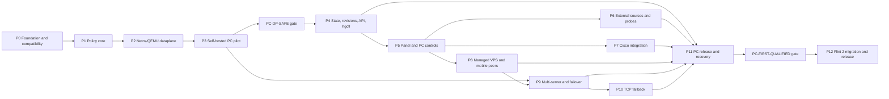

# Home Gateway Development Master Plan

> **For agentic workers:** REQUIRED SUB-SKILL: use `superpowers:writing-plans` to create a phase-specific plan, then `superpowers:subagent-driven-development` (recommended) or `superpowers:executing-plans` to implement it task by task. This master plan does not authorize implementation without the phase approval gate.

**Goal:** сначала реализовать и подтвердить на текущем Windows PC воспроизводимый и безопасно обновляемый selective-routing gateway через один минимальный self-hosted DigitalOcean AmneziaWG server; затем добавить управляемые server/mobile/failover функции поверх уже принятого own-VPS path; только после успешного self-hosted PC-first acceptance перенести тот же policy/control plane на GL.iNet Flint 2 / GL-MT6000 как домашний шлюз для всей сети.

**Architecture:** PC-first risk-first modular monolith на Go с платформонезависимыми policy/control-plane contracts, сменными platform adapters и отдельным `TunnelBackend` contract. P2 завершает Linux/OpenWrt dataplane в network namespaces/QEMU; P3 подключает Windows adapter к одному вручную созданному self-hosted DigitalOcean AmneziaWG server и закрывает `pc-core-ready` без cloud API или server-management automation. P4–P7 развивают локальные функции поверх собственного static tunnel. P8 operationalizes тот же VPS/backend без изменения policy/API semantics и открывает managed server/mobile functions P8–P11. Только после `pc-first-qualified` выполняется финальная миграция на Flint 2 с повторным полным safety acceptance; P2 OpenWrt backend при этом переиспользуется, а не переписывается.

**Tech Stack:** Go; Windows-supported TUN/routing/firewall/DNS primitives behind a dedicated platform adapter; PowerShell; Pester; Playwright; OpenWrt 25.12.5, target `mediatek/filogic`, package architecture `aarch64_cortex-a53`; `netifd`; `firewall4`; `nftables`; `ip rule`; `dnsmasq-full`; портированные из официальных upstream AmneziaWG module/tools; SQLite-compatible embedded store; Go `html/template` + HTMX или эквивалентный малый vendored JS; Linux network namespaces; OpenWrt QEMU/SDK; GitHub Actions или эквивалентный CI.

## Global Constraints

- На каждой target platform исходный direct/WAN path остаётся безопасным default; VPN-class управляется отдельными policy routes/rules и не получает незащищённый fallback.
- Только активный platform adapter `routerd` владеет создаваемыми проектом routes, rules, firewall sets и tunnel bindings; Windows и OpenWrt adapters не работают одновременно на одном host.
- VPN-класс при недоступном VPN завершается `blackhole`/`unreachable` и не проваливается в WAN.
- `direct`, `system-direct` и разрешённый Cisco traffic продолжают работать при падении VPN.
- IPv4 и IPv6 реализуются и тестируются вместе; режим IPv6 для VPN-класса — route или explicit block без утечки.
- Control plane не реализует криптографию и не проксирует пользовательский traffic.
- Любое изменение проходит plan, validation, snapshot, apply, post-check и commit/rollback.
- External content является data; remote shell scripts не исполняются.
- Все production versions, artifacts, image digests и SHA-256 фиксируются в manifest; `latest` запрещён. Единственное P3 canary-исключение — поддерживаемый AmneziaVPN GUI сейчас тянет rolling server image: его фактический immutable image ID/digest записывается сразу после установки, reproducible-production claim запрещён, а P8 обязан перейти на digest-pinned automation.
- Secrets, private keys, mobile profiles и full backups не попадают в Git, logs, process arguments или support bundles.
- Любой импортированный tunnel profile, включая новый self-hosted PC profile и сохранённый исторический RedShield config, считается external secret: используется только локально из защищённого хранилища, не копируется в fixtures/evidence и не требуется для CI.
- Cisco profile/policy, certificates и TLS traffic не изменяются и не инспектируются.
- Русский — основной язык UI/docs; identifiers, API и code — English.
- Все project-owned install/update operations идемпотентны, поддерживают dry-run и безопасное повторное выполнение. Внешний интерактивный Amnezia GUI installer в P3 не объявляется idempotent; перед ним действует plan gate, после него — observed-state gate и отдельный destructive clear/rebuild path.
- PC-first release включает panel, sources, Cisco integration, mobile peers, backup, multi-server model и рабочий TCP fallback; router release добавляет OpenWrt migration и network-wide routing без изменения policy semantics.
- Наличие готового official AWG2 package для OpenWrt не предполагается: compatibility gate должен собрать и проверить exact module/tools/netifd tuple.

---

## 1. Статус входных данных

- Канонический input: `SPEC.md`, версия 1.0 от 2026-07-11.
- Git инициализирован; P0, P1 и software/emulated scope P2 завершены в отдельных phase branches/worktrees; P3 реализуется отдельно и не меняет P2 regression baseline.
- Текущая Windows-машина является первой production target для P3–P11; Linux/OpenWrt lab и artifacts из P0–P2 сохраняются как regression baseline и заготовка финальной router migration.
- Покупка Flint 2 и hardware gates не блокируют P3–P11. Router требуется только после успешного `pc-first-qualified` gate перед P12.

### 1.1. Проверенный upstream baseline на 2026-07-12

| Area | Подтверждённый факт | Следствие для разработки |
|---|---|---|
| OpenWrt | 25.12.5 — stable; GL-MT6000 находится в `mediatek/filogic`, package arch `aarch64_cortex-a53`, kernel baseline `6.12.94` | Lock exact image/SDK SHA, kernel ABI/vermagic и profile metadata; binary внутри APK собирается как `GOOS=linux GOARCH=arm64` |
| OpenWrt packages | 25.12 использует APK v3; canonical package metadata должна указывать `aarch64_cortex-a53` | Release artifact называется `routerd_<version>_aarch64_cortex-a53.apk`, а не неоднозначное `aarch64.apk` |
| AmneziaWG OpenWrt | Официальный `amneziawg-openwrt` не публикует готовые 25.12/AWG2 releases; старый helper не знает AWG2 fields `S3`, `S4`, `I1..I5` | P0 обязан портировать свежие official kernel/tools в OpenWrt package feed и обновить `netifd` proto/UCI schema |
| AmneziaWG current pair | Official kernel tag `v1.0.20260611` и tools release `v1.0.20260618-2` содержат AWG2 UAPI/`syncconf`, но не OpenWrt assets | Эти версии — starting candidate, не accepted dependency, пока APK/module load/handshake/reboot/performance не пройдут на exact kernel |
| AWG userspace contingency | Official `amneziawg-go` tag `v0.2.19` поддерживает AWG2, но не публикует готовые binaries | Contingency требует arm64 cross-build, `netifd`/`procd` integration и benchmark; 300 Mbps заранее не обещается |
| DNS/firewall | OpenWrt `dnsmasq-full` поддерживает nftset; default image содержит обычный `dnsmasq`; `firewall4` читает `ruleset-post/*.nft` | Installer транзакционно заменяет package с сохранением UCI; заранее создаются отдельные IPv4/IPv6 sets |
| Staging | `fw4 print` рендерит active auto-includes и не принимает отдельный staging include path | Validator формирует отдельный complete candidate ruleset из `fw4 print` + staged fragment и запускает `nft -c -f` до замены active include |
| TCP fallback | Xray VLESS Reality/TUN и sing-box TUN/Reality доступны; sing-box `auto_route`/`auto_redirect` сами меняют routing/firewall | Выбранный core запускается с auto-routing выключенным; все marks/routes остаются собственностью `routerd` |
| Runet Freedom | Категории `ru-blocked`/`ru-available-only-inside` не являются asset names большого release | Descriptor задаёт immutable asset, checksum и converter/category; предпочтительны отдельные `ru-blocked.txt`/`geosite-ru-only.dat`, где доступны |
| Re:filter | `community.lst` сейчас не является release asset и существует как mutable branch file | Использовать commit-pinned blob/content SHA либо собственный immutable mirror; не подменять семантически другим asset |

Primary evidence фиксируется в `docs/COMPATIBILITY.md`: [OpenWrt 25.12](https://openwrt.org/releases/25.12/start), [25.12.5 filogic profiles](https://downloads.openwrt.org/releases/25.12.5/targets/mediatek/filogic/profiles.json), [AmneziaWG kernel v1.0.20260611](https://github.com/amnezia-vpn/amneziawg-linux-kernel-module/tree/v1.0.20260611), [AmneziaWG tools v1.0.20260618-2](https://github.com/amnezia-vpn/amneziawg-tools/releases/tag/v1.0.20260618-2), [OpenWrt AmneziaWG helper](https://github.com/amnezia-vpn/amneziawg-openwrt/blob/master/amneziawg-tools/files/amneziawg.sh), [firewall4 include contract](https://github.com/openwrt/firewall4/blob/b6e5157527d361f99ad52eaa6da273cb0f2dfd59/root/usr/share/nftables.d/README), [OpenWrt sing-box package](https://github.com/openwrt/packages/blob/openwrt-25.12/net/sing-box/Makefile).

## 2. Подтверждённые пользовательские решения

1. До покупки Flint 2 selective routing сначала проходит полную приёмку на текущем Windows PC через один минимальный self-hosted DigitalOcean AmneziaWG server.
2. Flint 2 приобретается и вводится только после успешного PC-first acceptance; перенос на router является отдельной финальной фазой P12.
3. После переноса Work PC с Cisco подключается непосредственно к Flint 2: Ethernet — основной вариант, прямой Wi-Fi Flint 2 допустим как резервный, Xiaomi-ретранслятор исключён.
4. Ethernet MAC/client-id и Wi-Fi MAC/client-id представляют одну logical device `work-pc` с несколькими разрешёнными identities.
5. Windows Random Hardware Address для домашнего SSID должен быть отключён либо явно диагностирован.
6. Если Cisco запрещает local LAN, система не обходит policy: панель открывается с другого разрешённого admin device либо после отключения Cisco.
7. В PC-first режиме `cisco-discovery` использует локальный API; после переноса он хранит pending snapshot локально и отправляет его после восстановления разрешённой связи с router API.
8. Решение владельца от 2026-08-27: RedShield больше не является target/required transport. P3 создаёт и квалифицирует первый own VPS; P8 добавляет automation, restricted `server-agent`, mobile lifecycle и telemetry. Текущее RedShield/Cisco live state не меняется без отдельного разрешения.

## 3. Уровни готовности

| Уровень | Значение | Что ещё не разрешено утверждать |
|---|---|---|
| `lab-safe` | Policy model и Linux/OpenWrt dataplane safety доказаны в unit/property/netns/QEMU tests | Реальная Windows PC/VPS и Flint 2 совместимость |
| `pc-core-ready` | Windows PC + один static self-hosted AmneziaWG server проходят selective-routing, fail-closed, restart, recovery и terminal `FullRestore` smoke | Managed server/mobile/failover scope и router qualification |
| `pc-first-qualified` | Все обязательные функции реализованы и приняты на Windows PC/VPS/Cisco/mobile стенде | Flint 2 migration, network-wide behavior и router performance |
| `field-qualified 1.0` | Закрыта вся acceptance matrix на реальном router/VPS/Cisco/mobile стенде | Ничего из обязательного scope |

Один собственный VPS является внешним P3 field gate и нужен для `pc-core-ready`; первый bootstrap выполняется вручную без DigitalOcean API. P8 добавляет `server-agent`, automation и mobile peer lifecycle на уже принятом сервере. Для `pc-first-qualified` multi-server scope и последующего `field-qualified 1.0` нужен второй собственный VPS у другого provider/ASN: provider locations или simulated failover не заменяют real acceptance.

## 4. Варианты декомпозиции

### Вариант A — safety spine → feature slices (выбран)

Сначала executable policy model и netns/QEMU dataplane, затем реальный Windows dataplane через один static self-hosted DigitalOcean AmneziaWG server; после этого headless control plane, UI и независимые feature slices развивают own-VPS PC-пилот. В P8 тот же `TunnelBackend` получает managed server/mobile lifecycle, P9–P11 доводят self-hosted PC-first продукт до полной приёмки, а Flint 2 добавляется последним platform slice поверх уже принятой логики.

### Вариант B — буквально Milestone 0–7 из спецификации

Проще сопоставлять прогресс исходному документу, но исходный Milestone 1 слишком широк, а revisions/rollback появляются только в Milestone 2. Это допускает реальный VPN dataplane до полноценного transaction/LKG механизма.

### Вариант C — component-first parallel

`routerd`, `server-agent`, Windows agent, web и installer развиваются отдельно, затем интегрируются. Подходит большой команде, но создаёт поздний contract drift и оставляет safety emergent property. Для solo/Codex execution не выбран.

## 5. Dependency map



P6, P7 и P8 можно разрабатывать параллельно только после стабильного P5. Merge каждого slice отдельно прогоняет полный `PC-DP-SAFE` regression suite. P12 не начинается и покупка Flint 2 не требуется, пока P11 не закроет `PC-FIRST-QUALIFIED` gate.

## 6. Обязательные architecture decisions до dataplane-кода

Phase 0 создаёт `DECISIONS.md` и следующие ADR. ADR принимается только с testable consequences и rollback/recovery implications.

| ADR | Решение, которое нужно зафиксировать | Рекомендуемая исходная позиция |
|---|---|---|
| ADR-0001 | Supported platforms и recovery path | Windows PC — первая production target; OpenWrt 25.12.5 `mediatek/filogic` / `aarch64_cortex-a53` — финальная router target; platform adapters имеют независимый recovery profile |
| ADR-0002 | Tunnel backends, AWG primary и TCP fallback | P3 квалифицирует static self-hosted AWG через provider-neutral importer/backend; P8 добавляет managed lifecycle; OpenWrt port из P0/P2 сохраняется для P12; independent VLESS Reality TUN adapter выбирается benchmark-ом на каждой platform |
| ADR-0003 | Routing ownership, marks и stickiness | Общая semantics скрыта за platform contract; Windows routes/firewall/TUN и OpenWrt marks/tables имеют одного owner; новые connections идут на active server, старые drain на прежнем healthy tunnel |
| ADR-0004 | Formal precedence и DNS no-leak scope | Origin tier выигрывает раньше specificity; specificity применяется внутри tier; shared-IP collision выбирает `direct`; guarantee действует для managed DNS и explicit device policy |
| ADR-0005 | Transaction/rollback model | Local commit-confirm watchdog; platform state + DB — coordinated local transaction; host/router↔VPS — idempotent saga с compensation, а не ложная distributed atomicity |
| ADR-0006 | State, secrets и portable backup | Embedded transactional store; secrets отделены; unattended backup использует `age` recipient, device keys wrap-ятся recovery key |
| ADR-0007 | Mobile peer lifecycle | One device/server pair — one keypair; one-time material single-consumption, TTL 10 minutes; DB сохраняет public key и metadata |
| ADR-0008 | Cisco discovery и device identity | Read-only Windows observation; scoped token; offline queue; logical device поддерживает Ethernet/Wi-Fi identities; work PC нельзя перевести в `always-vpn` |
| ADR-0009 | Supply chain и signing | Separate development/release signing; no secret in CI logs; manifest, checksums, signatures, SBOM и provenance обязательны |
| ADR-0011 | PC-first platform/tunnel boundary | Policy, DesiredState, API и audit не зависят от OS или VPN provider; Windows/OpenWrt реализуют один tested `RoutingBackend`, RedShield/self-hosted paths реализуют один `TunnelBackend`; P8/P12 не меняют public semantics |
| ADR-0016 | P3 self-hosted DigitalOcean bootstrap | Первый own VPS и static PC peer переходят в P3; P8 сохраняет automation/mobile scope; RedShield остаётся historical compatibility evidence и не меняется live без отдельного gate |

Дополнительные решения, входящие в ADR/tests:

- `system-direct` не является произвольно редактируемым списком: writers — inventory, server manager, Cisco endpoint approver, DNS/NTP/recovery manager; каждое изменение audited.
- Cisco split tunnel и full tunnel имеют разные acceptance branches. При full tunnel система только диагностирует и не обещает routing non-work traffic через локальный или router VPN.
- Work PC до прохождения Cisco field gate работает в `always-direct` либо в ограниченном `auto` без внешних auto-applied VPN entries.
- Cold boot сначала восстанавливает last-known-good safety rules/sets, затем открывает forwarding; cached client destinations и DoH limitation явно входят в threat/guarantee model.
- Trust modes унифицируются как `manual-approval` и `trusted-auto-apply`; пример `staged-auto` мигрирует в один из этих enum values.
- UI action называется `Работа / прямой WAN`, а не создаёт впечатление, что система умеет направить traffic внутрь Cisco tunnel.

## 7. Dataplane safety gate

До P4 запрещено начинать production API/UI. P1–P2 доказывают platform-neutral policy и Linux/OpenWrt lab invariants; P3 повторяет ту же матрицу на Windows PC с одним реальным self-hosted DigitalOcean AmneziaWG tunnel:

| Traffic class | VPN healthy | VPN unavailable | Проверяемый инвариант |
|---|---|---|---|
| default / `direct` | direct Internet | direct Internet | исходный default route не захватывается проектом |
| `system-direct` | WAN | WAN | VPN/Cisco/DNS/NTP/recovery endpoints не рекурсируют в VPN |
| `vpn` | selected VPN | terminal block | lookup не проваливается в `main` |
| `always-vpn` | selected VPN, кроме protected exceptions | terminal block, кроме protected exceptions | нет global WAN outage |
| `auto-cisco` fixture | WAN только для `work-pc` identity | WAN только для `work-pc` identity | другие devices не получают исключение |
| IPv6 VPN-class | VPN или explicit block | explicit block | на WAN нет VPN-class packet |
| TCP/UDP/QUIC | единая policy | единая fail-closed policy | rules не ограничены TCP/443 |

Evidence bundle содержит два слоя: P2 сохраняет `nft` counters, `ip rule/route` dump, DNS set membership и namespace/QEMU captures; P3 добавляет Windows route/firewall/TUN/DNS state, packet captures direct/VPN paths, apply/rollback logs и restart/LKG report. Fault injection включает AWG down, adapter/interface removal, invalid candidate config, failed post-check, daemon crash и OS restart. Одинаковая decision matrix обязательна на обеих platform implementations.

## 8. Phase execution protocol

Для каждой фазы:

1. Создать `docs/superpowers/plans/YYYY-MM-DD-pNN-<name>.md` с exact files, interfaces, TDD steps, commands и expected results.
2. Обновить acceptance traceability для требований фазы.
3. Получить подтверждение пользователя; одна фаза — один development cycle.
4. После Git initialization выполнять работу в отдельной branch/worktree.
5. Писать failing test, подтверждать failure, добавлять минимальную implementation, подтверждать pass.
6. Делить изменения на independently reviewable commits; не смешивать dataplane, UI и deployment.
7. Выполнить implementation review, security review и architecture/adversarial review по риску фазы.
8. Запустить полный regression gate, исправить findings и повторить verification.
9. Обновить `STATUS.md`, `DECISIONS.md`, ADR, docs и evidence links; только затем закрыть фазу.

Изменение routing/DNS/revision logic всегда запускает network namespace suite. Waiver для safety tests не допускается.

---

## 9. Phases

### P0 — Foundation, compatibility и executable lab

**Spec mapping:** §0, §3, §7–8, §21, §23, §25, §29, §31–33, §38.

**Files:**

- Canonical specification: `SPEC.md`; repository baseline already uses this name.
- Create: `README.md`, `STATUS.md`, `DECISIONS.md`, `.gitignore`, `Makefile`, `go.work`, root Go module files.
- Create: `docs/adr/ADR-0001` … `ADR-0009`, `docs/SECURITY.md`, `docs/COMPATIBILITY.md`.
- Create: `configs/defaults.yaml`, `configs/inventory.example.yaml`, `configs/routerd.example.yaml`, `configs/builtin-sources.yaml`.
- Create: `manifest/versions.lock.yaml`, `manifest/checksums.lock`, `api/openapi.yaml` skeleton.
- Create: `scripts/dev.ps1`, `tests/network-ns/`, `tests/openwrt-qemu/`, `tests/windows-pester/`, `.github/workflows/`.

**Work:**

1. Инициализировать Git и принять documentation baseline первым commit.
2. Создать Windows PowerShell 5.1-compatible developer entrypoint; PowerShell 7 остаётся preferred, но не единственным path.
3. Зафиксировать Go/tool versions и checksums только после clean host/cross-build spike.
4. Поднять Linux lab с `CAP_NET_ADMIN`, `nftables`, `iproute2` и `dnsmasq-full`; локально это отдельный WSL distro/VM либо remote CI runner, не `docker-desktop` по предположению.
5. Lock OpenWrt 25.12.5 `mediatek/filogic`, `aarch64_cortex-a53`, exact image/SDK SHA and kernel ABI/vermagic; проверить оба recovery profiles.
6. Собрать `kmod-amneziawg` и tools из current official AWG2 candidate tags в exact OpenWrt SDK, обновить `netifd` proto/UCI schema, подготовить dry-run-first hardware smoke и отдельно измерить размер `amneziawg-go` contingency.
7. Создать contract-only binaries `routerd`, `server-agent`, `cisco-discovery`, `hgctl` и cross-build matrix без бизнес-логики.
8. Привязать каждое acceptance requirement к автоматическому test, hardware test или explicit external gate.

**Verification:**

```powershell
.\scripts\dev.ps1 verify
```

Expected: host unit smoke, four cross-build targets, Pester smoke, manifest validation and secret scan pass; no network mutation on the Windows host.

```text
make verify
```

Expected on Linux CI: the same checks plus network-lab prerequisite smoke. `make` is a CI/Linux entrypoint; Windows does not depend on locally installed GNU Make.

**Exit gate:** accepted ADR set; verified compatibility tuple with pinned sources/checksums; AWG2 kernel/tools packages build reproducibly in the exact SDK; hardware module/UAPI smoke is prepared and explicitly deferred; buildable repository; one-command verification. Flint 2 hardware smoke and router-to-VPS handshake block P12, not PC-first phases P3–P11.

### P1 — Deterministic policy core

**Spec mapping:** §4, §6, §12, §23.2, §29.1–29.2.

**Files:** `pkg/contracts/`, `internal/lists/`, `internal/routing/policy/`, `internal/routing/explain/`, focused test and fuzz files.

**Produces:** canonical `DesiredState`, `RouteEntry`, `RouteDecision`, precedence matrix, normalization pipeline and pure `Plan` output. No shell/root/platform calls.

**Work:**

1. Implement domain/IDNA/PSL/CIDR normalization with size limits and deterministic dedup/subsumption.
2. Encode protected origin tiers, manual overrides, specificity, scope, shared-IP conflict and expiry as table-driven policy.
3. Represent one logical device with multiple identities and prohibit `always-vpn` for protected work devices.
4. Encode per-server mark/table selection needed for session drain semantics.
5. Add `route explain` evidence showing every matched tier and conflict.

**Verification:** `go test ./internal/lists/... ./internal/routing/...`; targeted fuzz runs for domain/CIDR inputs; deterministic golden cases for every precedence pair.

**Exit gate:** all policy results are deterministic and platform-independent; no ambiguous spec rule remains outside ADR-0003/0004.

### P2 — Production dataplane backend in network namespaces and OpenWrt QEMU

**Spec mapping:** §4.1–4.7, §9, §19, §28, §29.3–29.4, §30.1–30.3.

**Files:** `internal/routing/nft/`, `internal/routing/iprule/`, `internal/dns/dnsmasq/`, `internal/revisions/apply/`, `internal/system/linux/`, `tests/network-ns/`, `tests/openwrt-qemu/`.

**Produces:** production `RoutingBackend` renderer/apply engine used later on router; fake tunnel is only a lab adapter.

**Work:**

1. Render owned nft table/chains/sets, reserved mark mask, per-server connection marks and v4/v6 routing tables.
2. Keep terminal `blackhole`/`unreachable` defaults when VPN is absent.
3. Render `firewall4` include and separate IPv4/IPv6 `dnsmasq-full` nftset configuration through staging; package replacement preserves UCI and rollback data.
4. Build a complete candidate ruleset from `fw4 print` plus staged fragment, validate it with `nft -c -f`, validate DNS with `dnsmasq --test`, then atomically swap active fragments and post-check.
5. Define nft default timeout plus aligned dnsmasq cache limits; verify A/AAAA/CNAME population and expiry instead of assuming exact DNS TTL copying.
6. Implement commit-confirm watchdog, last-known-good rollback and safe boot ordering.
7. Build namespace topology and packet-capture assertions for the full safety matrix.

**Verification:** `sudo tests/network-ns/run.sh`; OpenWrt QEMU package/config smoke; at least 20 consecutive fault-injection loops without flake.

**Exit gate:** all §7 dataplane invariants pass in netns and QEMU; invalid apply, crash and reboot preserve WAN management and VPN-class fail-closed behavior.

### P3 — Self-hosted PC-first VPN pilot on Windows

**Spec mapping:** §4.1–4.7 semantics adapted to one Windows host, §7–11 excluding real multi-server failover, §18 baseline, §26 bootstrap subset, §29.4, §30.1–30.3.

**Files:** provider-neutral `TunnelBackend` contracts, protected local AWG 3.1 config importer, non-secret DigitalOcean create plan, hash-pinned official AmneziaVPN client plus observed server image identity contract, Windows `RoutingBackend` adapter under `internal/system/windows/`, Windows install/recovery smoke scripts and platform contract tests. Secret configs, SSH private keys and generated runtime state remain outside Git.

**Consumes:** P1 policy contracts, P2 `RoutingBackend` semantics and safety matrix, one manually created DigitalOcean Droplet and one protected static self-hosted AmneziaWG PC profile. P2 Linux/OpenWrt implementation remains unchanged and is reused in P12.

**Work:**

1. Retain ADR-0011 and accept ADR-0016; validate the exact self-hosted config format without printing keys. WireGuard and AmneziaWG remain supported parser candidates; proprietary app-only state is not an integration contract.
2. Create one DigitalOcean Droplet manually from a reviewed non-secret plan, use the hash-pinned official AmneziaVPN GUI to install only AmneziaWG, record the observed server image identity and export one native guest profile. Import it from protected local storage, preserve endpoint, keys and obfuscation fields, and prevent it from entering Git, logs, evidence bundles or command-line arguments.
3. Implement the Windows platform adapter for project-owned routes, firewall/DNS state, tunnel lifecycle, validation, apply, LKG and rollback without changing Cisco configuration.
4. Keep the self-hosted endpoint and protected system/Cisco destinations on the direct path; implement VPN-class fail-closed for IPv4 and IPv6 without changing Cisco or relying on automatic cloud actions.
5. Repeat the complete safety matrix, MTU, TCP/UDP/QUIC, daemon crash, adapter loss, OS restart and recovery on the current Windows PC.
6. Produce a minimal operator flow to enable, inspect, disable and fully restore the pre-install Windows network state; keep automated server-management operations unavailable until P8.

**Verification:** AWG 3.1 config schema/redaction and create-plan tests; pinned client hash plus observed server image identity; documented clear-server/rebuild behavior; Windows install/upgrade/remove and rollback smoke; observed handshake plus real direct/self-hosted egress and DNS/IPv6 assertions; tunnel-down packet capture; Cisco-off fixture; restart persistence, emergency disable and terminal `FullRestore`. Tests must not persist or echo the real config.

**Exit gate:** `pc-core-ready`; selective routing through the self-hosted server works on the current PC, protected traffic is fail-closed, direct/Cisco paths remain available, terminal journaled `FullRestore` restores prior project-owned network state, and `PC-DP-SAFE` is frozen as mandatory regression suite. P8 automation/mobile scope and Flint 2 are not required.

### P4 — State, revisions, local API and `hgctl`

**Spec mapping:** §12.4, §18.3, §21–24, §27 baseline.

**Files:** `internal/config/`, `internal/revisions/`, `internal/secrets/`, `internal/audit/`, `internal/api/`, `cmd/hgctl/`, `api/openapi.yaml`, migration tests.

**Produces:** headless flow `add → plan/diff → validate → apply → explain → rollback`; stable OpenAPI/contracts for UI and agents.

**Work:**

1. Implement embedded store schema/migrations, corruption checks, batched writes and tmpfs metric buffer.
2. Separate secret material and metadata; prevent command-line/log exposure.
3. Orchestrate local commit-confirm and remote idempotent saga with locks/idempotency keys.
4. Implement versioned local/LAN API, scoped agent tokens, SSE and `hgctl` emergency operations; PC-first defaults to loopback/local access.
5. Persist revision/apply/audit evidence and restore LKG after restart.

**Verification:** `go test -race ./...`; migration/corruption/property tests; OpenAPI conformance; Windows restart/rollback smoke plus P2 lab regression.

**Exit gate:** complete headless configuration flow works on the Windows PC and in the P2 lab without direct active-config edits.

### P5 — Secure panel and PC controls

**Spec mapping:** §6.6, §16, §19 UI controls, §24 UI-facing endpoints, §29.6.

**Files:** `internal/auth/`, `internal/web/`, `web/templates/`, `web/static/`, `web/locales/`, platform-neutral device/network contracts and Playwright tests.

**Work:**

1. Add local CA, fingerprint confirmation, enrollment, Argon2id auth, sessions, CSRF, CSP and rate limits.
2. Implement dashboard, manual lists, devices, servers, pending diff, apply/rollback and diagnostics.
3. Implement PC status, enable/disable, current egress, route explanation and emergency direct-recovery controls without exposing the panel beyond configured interfaces.
4. Model the local protected `work-pc`, prohibit unsafe `always-vpn` while Cisco state is unresolved, and keep future device/SSID contracts platform-neutral for P12.
5. Keep frontend assets vendored/self-contained; no CDN or heavy SPA runtime.

**Verification:** Playwright full user flow; auth/session/CSRF/upload tests; Windows firewall tests prove the panel is unavailable from unapproved interfaces; P2 lab regression remains green.

**Exit gate:** Windows browser completes enroll, add/probe/apply/explain/rollback while `PC-DP-SAFE` stays green.

### P6 — External sources and smart probes

**Spec mapping:** §13–14, §16.5, §25.2, §28 source/apply targets, §29.1–29.2.

**Files:** `internal/sources/`, converters/adapters, `configs/builtin-sources.yaml`, source UI/API, deterministic fixtures and fuzz corpora.

**Work:**

1. Implement streaming bounded parsers and isolated converters for each accepted data format.
2. Resolve GitHub release metadata without executing upstream code; pin parser/converter dependencies and immutable asset digests.
3. Model Runet Freedom category extraction explicitly; prefer standalone immutable/checksummed assets to downloading the full ~72 MB geodata bundle every six hours.
4. Treat Re:filter `community.lst` as a commit-pinned file or immutable project mirror, not as a nonexistent release asset.
5. Implement direct → active VPN → mirror → Windows upload fallback chain for provider-backed mode; keep the allowlisted `server-agent` step capability-gated until P8.
6. Reject HTML/empty/default-route/private-range/bare-suffix/oversize/signature mismatch/anomalous diff updates.
7. Retain LKG and present added/removed/conflict/effective diff.
8. Add on-demand direct/per-VPN probes and suggestion-only classification; no route changes after one observation.

**Verification:** deterministic offline fixtures first, live sources only as non-blocking canaries; fuzz/property tests; 100k-domain apply benchmark on the current PC with no direct-path loss and target `<15 s` or a release-blocking optimization decision. Flint 2 resource/performance benchmark is deferred to P12.

**Exit gate:** corrupted/unavailable upstream cannot change active routing; representative aggregate default-source size fits measured PC memory/storage/apply budgets without weakening the later Flint 2 budget gate.

### P7 — Cisco Secure Client integration

**Spec mapping:** §4.5, §6.2, §15, §16.9, §29.5, §30.1, §30.8.

**Files:** `cmd/cisco-discovery/`, `internal/cisco/`, `deploy/windows/`, `scripts/install-cisco-agent.ps1`, `tests/windows-pester/`, Cisco UI/API.

**Work:**

1. Collect documented routes, adapters, DNS, suffix, NRPT and Cisco endpoint metadata without changing Cisco.
2. Diff before/after snapshots and classify split tunnel, full tunnel, stale state and LAN-blocked state.
3. Enroll a scoped token using Windows-protected storage; use the local API in PC-first mode and retain the offline queue contract needed after P12 migration.
4. Add verified Cisco endpoint to trusted `system-direct`; require approval for public work portals.
5. Scope `auto-cisco` to the logical `work-pc` identities only.

**Verification:** Pester fixtures for no Cisco/split/full tunnel/NRPT/randomized MAC/stale queue/signature; real PC-first Ethernet/Wi-Fi snapshots with Cisco; one-workday soak. Flint-connected snapshots are deferred to P12.

**Exit gate:** split-tunnel branch proves Cisco endpoint direct, internal routes remain OS-owned, public work portals use WAN/Cisco exit, blocked non-work resources use the local PC VPN where policy allows; full-tunnel branch proves diagnosis and non-interference only.

### P8 — Managed VPS operations and mobile peer lifecycle

**Spec mapping:** §7–11 single self-hosted server baseline, §17–18 peer operations, §16.7, §24 peer endpoints, §30.1–30.4.

**Files:** `cmd/server-agent/`, `internal/servers/`, `internal/sshagent/`, `deploy/server/`, self-hosted `TunnelBackend`, `internal/mobile/`, `pkg/contracts/serveragent/`, peer operations, one-time delivery, QR/config UI/API and tests.

**Work:**

1. Reconcile the P3-qualified server idempotently from pinned artifacts and implement restricted `server-agent` operations through a versioned allowlisted JSON protocol over SSH forced command with no `shell.exec`.
2. Preserve the accepted self-hosted PC `TunnelBackend` behavior while moving static/manual operations under the managed lifecycle; rerun `PC-DP-SAFE` with equivalent policy, lists, UI/API and route decisions.
3. Keep historical RedShield compatibility outside normal operation; do not add automatic fallback or restore it as a production dependency.
4. Create one keypair per mobile device/server pair; persist only public key/metadata after delivery.
5. Make one-time profile single-consumption with 10-minute TTL, cache-control and audit without secret logging.
6. Apply peer changes transactionally through official `awg syncconf`/supported mechanism; implement stats, disable, rotate and revoke idempotently.
7. Use tunnel-only DNS for full-tunnel mobile profiles.

**Verification:** pinned managed-server reconciliation/recovery; P3-static-versus-P8-managed decision equivalence; real PC egress/DNS/IPv6 and fail-closed regression; server protocol fuzzing; one-time lifecycle tests; physical mobile import over cellular; revoke stops access within 10 seconds and does not affect other devices.

**Exit gate:** the P3-qualified own VPS is managed without policy/API regression; full mobile acceptance passes on that server and one physical client. RedShield remains unnecessary for normal operation.

### P9 — Multi-server health, stickiness and failover

**Spec mapping:** §11, §16.6, §17.6, §27 health, §30.1–30.2.

**Files:** `internal/health/`, multi-server routing/servers code, fake-clock tests, multi-VPS integration fixtures.

**Work:**

1. Implement interface/handshake/DNS/TLS/egress/country/loss health composite.
2. Use fake clock to verify `3 failures down`, `2 successes up`, `120s hold-down`, `10m stable failback`.
3. Validate candidate before activation and atomically switch platform-specific selection for new connections.
4. Preserve or drain existing sessions where the Windows adapter can prove ownership; otherwise terminate them fail-closed and never migrate VPN-class sessions to the direct path.
5. Verify VPN endpoint host routes and Cisco/direct routing remain unchanged.
6. Execute real failover on two VPS from different provider/ASN.

**Verification:** deterministic state-machine/property tests; packet captures during switch; repeated real outage/failback cycles; all-server mobile revoke.

**Exit gate:** no flapping or WAN leak, existing/new connection semantics match ADR-0003, real dual-VPS acceptance passes.

### P10 — Independent VLESS Reality TCP fallback

**Spec mapping:** §8.1–8.2, §10.2–10.3, §30 failure modes, §37.

**Files:** fallback `TunnelBackend` adapter, pinned server deployment, Windows service/config integration, platform-neutral health contracts and integration tests.

**Work:**

1. Benchmark/select a Windows-compatible sing-box or XRay TUN adapter under current-PC RAM/CPU constraints; record the independent OpenWrt selection gate for P12.
2. Deploy independent VLESS Reality TCP/443 server path with separate config/process/health.
3. Disable sing-box `auto_route`/`auto_redirect` or equivalent Xray automation; route the same VPN-class through the Windows owner adapter so the fallback process never owns global policy routing.
4. Define and test IPv4/IPv6, DNS, TCP and UDP/QUIC behavior. Unsupported traffic remains fail-closed and is shown explicitly.
5. Simulate UDP/AWG blocking and verify safe transition/recovery.

**Verification:** fault-injection matrix, egress/DNS/IPv6 tests, resource benchmark and AWG/fallback isolation tests.

**Exit gate:** AWG degradation either switches eligible VPN-class traffic to healthy fallback or blocks it; no traffic leaks to WAN and `routerd` remains sole policy owner.

### P11 — PC-first installer, backup, hardening and acceptance

**Spec mapping:** §20, §16.10, §21–22, §26–31 Windows/PC subset, §30.5 and all PC-applicable acceptance criteria.

**Files:** `internal/backup/`, `scripts/bootstrap.ps1`, `scripts/backup.ps1`, `scripts/recovery.ps1`, Windows service/update/uninstall scripts, `packaging/release/`, `docs/RECOVERY.md`, PC-first operations/security docs, restore fixtures/tests and release workflows.

**Consumes:** stable schemas/contracts from P4–P10, including sources, Cisco, mobile peers, multi-server state and fallback metadata.

**Work:**

1. Implement verified, resumable, idempotent Windows `bootstrap.ps1` with `-WhatIf`, explicit recovery checkpoints, upgrade and complete uninstall/network-state restoration.
2. Create versioned `age` archive with checksums, schema/platform manifest and explicit full/sanitized scopes.
3. Use recipient-based encryption for unattended backup; require interactive secret handling where a passphrase is selected.
4. Implement verify, restore-plan, compatibility check, emergency current-state backup and restore saga; add 7 daily / 4 weekly / 6 monthly retention.
5. Generate checksums, signatures, SBOM, license notices and provenance for the Windows PC/server bundle; redact support exports and prove absence of private material.
6. Run the full PC-first security, fault-injection, clean install/upgrade/uninstall, DNS/IPv6 leak, multi-VPS, mobile, backup restore and Cisco workday acceptance batch.

**Verification:** clean offline Windows install from the release bundle; restore onto a clean/resettable Windows PC test state plus VPS; corruption/wrong-key/version mismatch tests; independent checksum/signature verification; full PC-applicable acceptance matrix; `STATUS.md` contains no PC-first blocker/critical open item.

**Exit gate:** `pc-first-qualified`; the current PC can be installed, operated, upgraded, backed up, restored and fully uninstalled safely; selective routing, sources, Cisco, mobile peers, multi-server and TCP fallback pass real acceptance. Only after this gate is accepted does the plan require purchasing Flint 2 and starting P12.

### P12 — Flint 2 migration, network-wide acceptance and signed router release

**Spec mapping:** OpenWrt/router-specific requirements in §4, §6, §9, §16, §19, §26–31, §37 plus all acceptance criteria not closed by PC-first.

**Consumes:** accepted `pc-first-qualified` release from P11 and the Linux/OpenWrt `RoutingBackend`, QEMU tests and compatibility artifacts already produced in P0–P2.

**Files:** `internal/system/openwrt/`, device/SSID adapters, `deploy/openwrt/`, `packaging/openwrt-apk/`, router install/update/recovery scripts, migration tooling, release workflows, all router docs/reports and final `dist/` assembly.

**Work:**

1. Acquire Flint 2 only after the P11 gate, verify its exact firmware/kernel tuple and execute the prepared dry-run-first module/UAPI smoke before any network cutover.
2. Complete the OpenWrt adapter against the same `RoutingBackend` contract; add Home/Home-Direct/Home-VPN networks without disabling the previous management path before smoke.
3. Deploy the existing personal-VPS configuration to the router peer with `route_allowed_ips=0` and a protected endpoint host route through WAN.
4. Package exact `routerd_<version>_aarch64_cortex-a53.apk` and pinned OpenWrt dependencies; implement PC-first config/secret migration with preview, backup, rollback and no semantic changes to policies/API.
5. Run security CI, fuzzing, P2 QEMU regression, APK lifecycle, clean install/upgrade/rollback, reboot/failsafe and recovery tests.
6. Run physical-router performance, flow offload, flash/RAM/CPU, 100k apply, ISP cutover, IPv6/DNS leak, multi-VPS, mobile, backup restore and Cisco Ethernet/direct-Wi-Fi workday tests.
7. Generate final checksums, signatures, SBOM, provenance and reproducibility evidence; complete router install/operations/security/recovery/troubleshooting/migration docs and compatibility matrix.

**Verification:** clean offline router build/install from the release bundle; migration from a real P11 PC-first backup; independent checksum/signature verification; full §30 acceptance matrix; PC and router decisions remain equivalent for shared fixtures; `STATUS.md` contains no blocker/critical open item.

**Exit gate:** `field-qualified 1.0`; exact `dist/` deliverables from the specification are reproducible and signed.

---

## 10. Acceptance traceability

| Spec area | Primary phases | Final proof |
|---|---|---|
| Goal, supplied infrastructure, logical architecture | P0, P3–P5, P7–P8, P12 | PC-first scenarios followed by equivalent router scenarios |
| Principles, route classes, precedence | P1–P3, P12 | Unit/property + netns/QEMU + Windows captures + final Flint captures |
| Platform dataplane, DNS, IPv6, QUIC | P2–P3, P12 | Shared safety matrix across lab, Windows PC and Flint 2 |
| Tunnel transport, AWG/VPS and server-agent | P3, P8, P12 | Static self-hosted PC pilot, managed server/mobile tests, then router migration proof |
| Multi-server/failover | P9 | Two providers/ASNs, repeated outage cycles |
| Lists, sources, probes | P1, P6 | Fuzz/offline fixtures + 100k hardware benchmark |
| Cisco | P7 | Fixture matrix + Ethernet/Wi-Fi field snapshots + workday soak |
| Panel/API/devices | P4–P5 | OpenAPI/security/Playwright + network access tests |
| Mobile peers | P8 | Physical cellular import, DNS, single-use and revoke |
| Backup/recovery | P11 | Restore to clean environment and redaction proof |
| TCP fallback | P10 | Independent path fault injection and resource benchmark |
| Installer/release/security/performance | P11–P12 | Signed PC-first release followed by clean router migration and final artifacts |
| Additional features and explicit non-goals | Global Constraints, §12 of this plan | Scope review proves no forbidden or post-1.0 feature entered the critical path |
| Final user scenarios and definition of done | P5–P12 | PC-first acceptance is mandatory before router purchase/migration; final §30 acceptance closes on Flint 2 |

## 11. External gates and honest blocker policy

The following evidence cannot be replaced by mocks:

- P3 self-hosted bootstrap: one real manually created DigitalOcean Droplet and native AmneziaWG guest profile must connect through the supported Windows integration; cloud/SSH/VPN credentials and keys remain outside repository evidence. Historical RedShield evidence is retained but is not an active gate.
- GL-MT6000: exact firmware/kernel/AWG compatibility, APK lifecycle, reboot/failsafe, flow offload, flash/RAM/CPU and throughput.
- One real VPS: P3 owns AWG handshake/egress/MTU and restricted SSH; P8 owns managed peer revoke and server backup.
- Two VPS on different provider/ASN: real health failover/failback and multi-server peer operations.
- Cisco work environment: endpoint discovery, split/full tunnel, NRPT/DNS, LAN policy and workday stability.
- Physical mobile client + cellular network: profile import, tunnel DNS, egress and revoke.
- ISP/ONT environment: DHCP/PPPoE/VLAN, bridge/double NAT, IPTV/VoIP and recovery path if these functions are used.
- Release signing credentials: production signatures and Windows trust cannot be represented by development test keys.

The GL-MT6000 and ISP/ONT gates are intentionally deferred to P12 and do not block P3–P11 or `pc-first-qualified`. One real own VPS is mandatory in P3 for `pc-core-ready`; P8 adds managed/mobile lifecycle, and the current Windows PC plus applicable Cisco/mobile gates are mandatory for P11. If an external gate required by the active phase is unavailable, software work may reach `awaiting-field-qualification`, but the corresponding acceptance item and release level remain open in `STATUS.md`.

## 12. Out of first-release scope

The following remain architecture-compatible but do not delay 1.0 unless the specification explicitly promotes them later:

- `dpi-direct` via Zapret2/ByeDPI;
- Tailscale/NetBird admin overlay;
- notification adapters;
- per-domain bandwidth history;
- multi-server subscription bundle;
- Ansible/Terraform provisioning;
- mesh/802.11r management;
- IPTV wizard beyond preserving an existing required setup;
- English UI, TOTP, Guest SSID, SFTP/object-storage backup, client-side peer key generation and active DoH blocking are optional features and are not prerequisites for core acceptance.

## 13. Approval gate

Approval of this document accepts:

1. PC-first safety decomposition P0–P12, with the completed P2 scope preserved as a regression baseline;
2. one manually created DigitalOcean AmneziaWG server and protected static PC profile as the P3 bootstrap, with RedShield retained only as historical compatibility evidence;
3. conditional Cisco full-tunnel acceptance;
4. platform-neutral per-server session selection with Windows-specific implementation first and OpenWrt marks/tables in P12;
5. mandatory qualification of one own VPS in P3 before `pc-core-ready`, followed by P8 mobile/server-controlled lifecycle;
6. Flint 2 purchase and all physical-router gates deferred until `pc-first-qualified`, followed by final P12 migration;
7. mandatory second own VPS for PC-first multi-server acceptance and final field-qualified failover;
8. separate phase plan/review/test cycle before every implementation phase;
9. correction of ambiguous APK naming and the mandatory AWG2/OpenWrt porting gate in P12.

P0-P2 are complete for their declared software/emulated scopes. The approved P3 PC-first implementation plan is active on the historically named `phase/p3-redshield-windows`; it now requires one external VPS field gate but must not start Flint 2 work or claim P8 managed/mobile acceptance.
